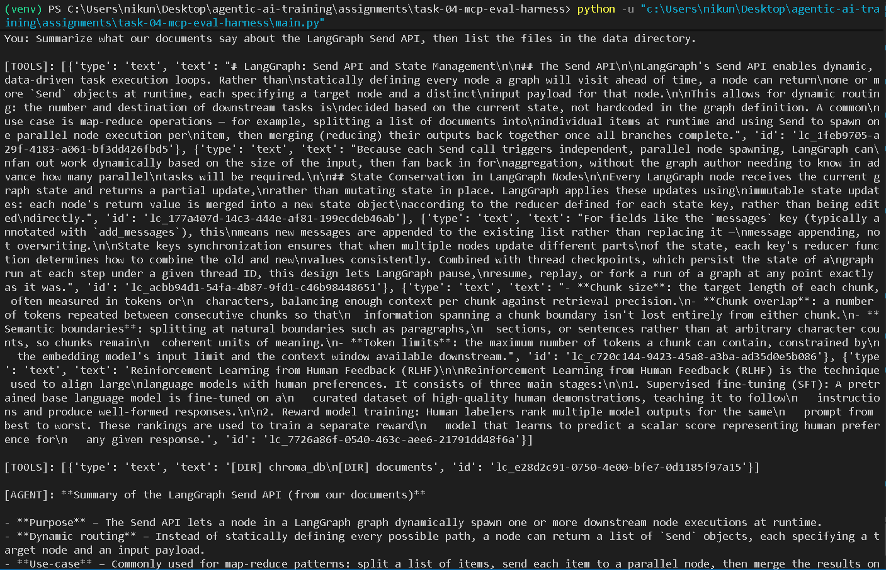
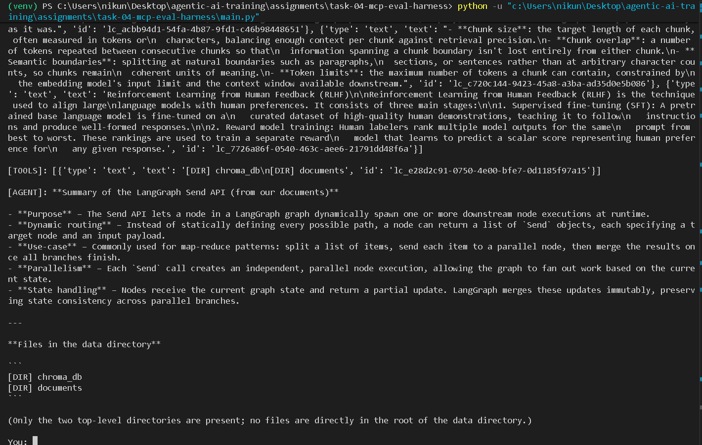
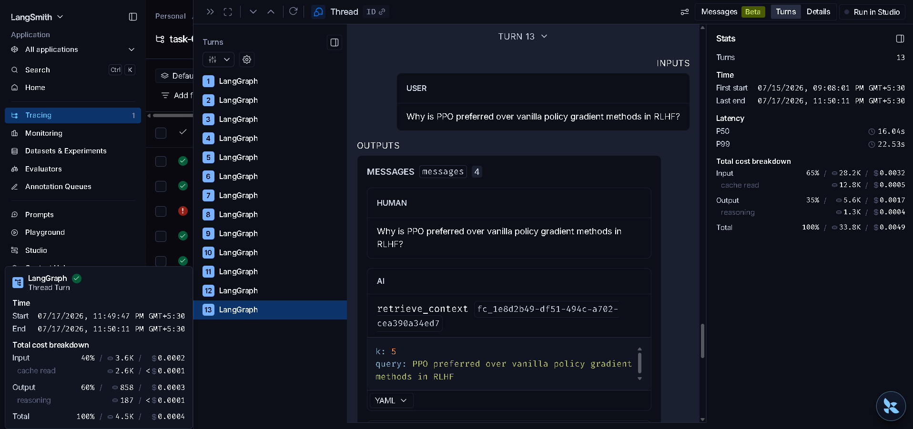

# Task 04 – MCP Tool Server, Interoperable Agent & Evaluation Harness

## Overview

This project implements an interoperable AI agent using the **Model Context Protocol (MCP)** and **LangGraph**. The agent dynamically loads tools from multiple MCP servers, performs **Retrieval-Augmented Generation (RAG)** over a local knowledge base, and includes a repeatable evaluation harness with **LangSmith tracing**.

This project demonstrates:

- Custom MCP server exposing reusable tools
- Multi-server MCP client using LangGraph
- Retrieval-Augmented Generation (RAG)
- Golden dataset evaluation harness
- LangSmith observability
- Multi-provider LLM support

---

# Architecture

```text
                        User Query
                             │
                             ▼
                    LangGraph ReAct Agent
                             │
              ┌──────────────┴──────────────┐
              │                             │
              ▼                             ▼
     Custom MCP Server              Filesystem MCP Server
      (FastMCP / stdio)              (Official Reference)
              │                             │
      ┌───────┼────────┐              Read Files
      │       │        │              List Directory
      ▼       ▼        ▼
retrieve_context calculate get_current_date
      │
      ▼
Chroma Vector Database
      │
      ▼
Local Documents
```

---

# Project Structure

```text
task-04-mcp-eval-harness/

├── agent/
│   ├── graph.py
│   ├── llm.py
│   ├── mcp_client.py
│   └── state.py
│
├── data/
│   └── documents/
│
├── eval/
│   ├── golden_dataset.json
│   ├── report.md
│   └── run_eval.py
│
├── mcp_server/
│   ├── server.py
│   └── tools.py
│
├── docs/
│   ├── screenshot-mcp-demo-part1.png
│   ├── screenshot-mcp-demo-part2.png
│   └── screenshot-langsmith-trace.png
│
├── main.py
├── requirements.txt
├── .env.example
└── README.md
```

---

# Features

- ✅ FastMCP server exposing reusable tools
- ✅ Retrieval-Augmented Generation using ChromaDB
- ✅ Multi-provider LLM factory
- ✅ Dynamic MCP tool loading
- ✅ Multi-server interoperability
- ✅ LangGraph ReAct agent
- ✅ Golden dataset evaluation harness
- ✅ LangSmith tracing
- ✅ CI-friendly evaluation script

---

# MCP Servers

## 1. Custom MCP Server

The custom MCP server exposes the following tools.

| Tool | Description |
|------|-------------|
| `retrieve_context` | Retrieves relevant document chunks from the Chroma vector database |
| `calculate_expression` | Safely evaluates mathematical expressions |
| `get_today_date` | Returns the current system date |

The server runs using the MCP **stdio** transport.

```bash
python -m mcp_server.server
```

---

## 2. External MCP Server

This project integrates the **Official Filesystem MCP Server**
(`@modelcontextprotocol/server-filesystem`), scoped to `./data`.

### Why this server

- It's the reference server documented directly in the assignment.
- Requires no additional API keys or accounts.
- Gives a simple, independently verifiable second capability (listing/reading
  files) that's easy to demonstrate alongside RAG retrieval in one
  conversation.

The agent dynamically loads tools from **both MCP servers** at startup using
`MultiServerMCPClient`.

---

# Installation

## Clone the Repository

```bash
git clone <repository-url>
cd task-04-mcp-eval-harness
```

## Create a Virtual Environment

```bash
python -m venv .venv
```

## Activate the Environment

### Windows

```bash
.venv\Scripts\activate
```

### Linux / macOS

```bash
source .venv/bin/activate
```

## Install Dependencies

```bash
pip install -r requirements.txt
```

Requires Node.js (for `npx`, used by the filesystem MCP server).

## Configure Environment Variables

```bash
cp .env.example .env
```

Populate the required API key(s) in the `.env` file. `agent/llm.py` checks
providers in this order: `ANTHROPIC_API_KEY` → `OPENAI_API_KEY` →
`GOOGLE_API_KEY` → `GROQ_API_KEY`, and uses the first one found.

---

# Building the Vector Store

```bash
python ingest.py
```

Reads `data/documents/*` and writes the persisted Chroma store to
`data/chroma_db/`.

---

# Running the MCP Server

```bash
python -m mcp_server.server
```

### Independent Validation

```bash
mcp dev mcp_server/server.py
```

Confirms `retrieve_context` returns real chunks before wiring up the agent.

---

# Running the Agent

```bash
python main.py
```

---

# Running the Evaluation Harness

```bash
python -m eval.run_eval
echo $?   # 0 if pass rate >= 80%, 1 otherwise
```

The evaluation script:

- Executes the full LangGraph agent for each golden-dataset question
- Uses an LLM-as-a-judge to score each response
- Generates `eval/report.md` with a per-question breakdown
- Exits non-zero if the aggregate pass rate is below 80%, making it
  CI-gateable

---

# Evaluation Rubric

Each response is scored by the LLM judge on:

| Metric | Scale |
|---|---|
| Faithfulness — is the answer grounded in correct information, without unsupported claims? | 0–5 |
| Relevance — does the answer directly address the question and stay on topic? | 0–5 |
| Fact coverage — does the answer include the important expected facts? | 0–5 |

### Passing Criteria

A question passes if **all three** hold:
- Faithfulness ≥ 3
- Relevance ≥ 3
- Fact coverage ≥ 4

**Note on fact coverage:** the assignment spec describes this dimension as
"≥ 70% of `expected_facts` covered." Rather than counting exact string
matches against the `expected_facts` list (which penalizes correct answers
that paraphrase), our judge scores coverage holistically on a 0–5 scale,
where 4/5 (80%) satisfies the ≥70% requirement while allowing for
semantically-equivalent phrasing.

---

# Evaluation Results

Latest run (see `eval/report.md` for the full per-question breakdown,
including scores and agent responses):

| Metric | Result |
|---|---|
| Dataset Size | 12 |
| Passed | 12 / 12 |
| Accuracy | 100.00% |

---

# Multi-Server MCP Demonstration

Example conversation used to demonstrate both MCP servers being called
within a single conversation:

**User**

> Summarize what our documents say about the LangGraph Send API, then list
> the files in the data directory.

**Agent**

- Calls `retrieve_context` on the **custom MCP server** to pull relevant
  chunks from `langgraph_send_api.md`
- Calls the filesystem server's `list_directory` tool on the **official
  filesystem MCP server**
- Produces a final response combining both results





---

# LangSmith Tracing

LangSmith tracing is enabled using:

```env
LANGCHAIN_TRACING_V2=true
LANGCHAIN_API_KEY=...
LANGCHAIN_PROJECT=task-04-mcp-eval
```

Evaluation runs include metadata:

```json
{
  "mode": "eval",
  "question_id": "<id>"
}
```

Interactive runs include metadata:

```json
{
  "mode": "interactive"
}
```



---

# Technologies Used

- Python
- LangGraph
- LangChain
- FastMCP
- Model Context Protocol (MCP)
- ChromaDB
- Sentence Transformers
- LangSmith
- Groq LLM (with Anthropic / OpenAI / Google fallback support)

---

# Acceptance Criteria

- ✅ FastMCP server exposing reusable tools
- ✅ Retrieval from an existing Chroma vector database
- ✅ Dynamic loading of tools from multiple MCP servers
- ✅ LangGraph ReAct agent
- ✅ Shared multi-provider LLM factory
- ✅ Golden dataset evaluation harness implementing a documented rubric
  (faithfulness ≥ 3, relevance ≥ 3, fact coverage ≥ 4/5)
- ✅ LangSmith tracing, tagged with `mode` metadata for eval vs. interactive
- ✅ Human-readable evaluation report
- ✅ CI-compatible exit status

---

# References

- Model Context Protocol (MCP)
- FastMCP Python SDK
- LangGraph
- LangChain
- LangSmith
- ChromaDB